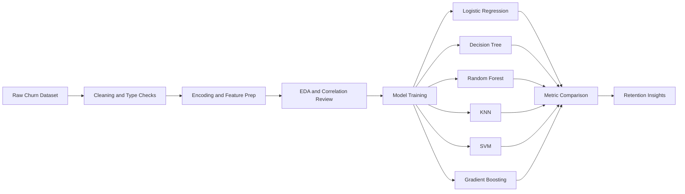
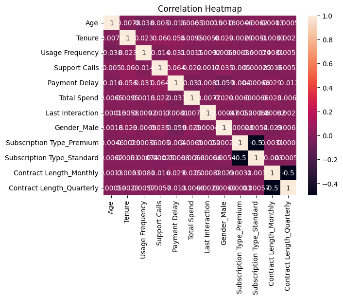
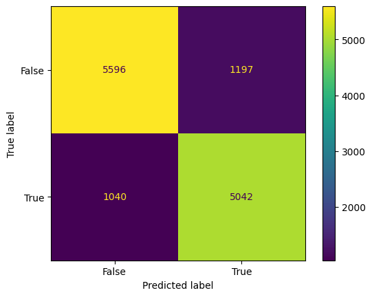
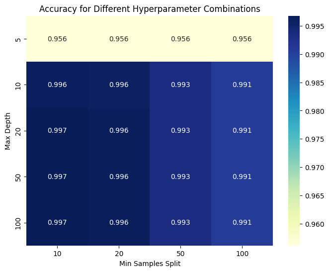
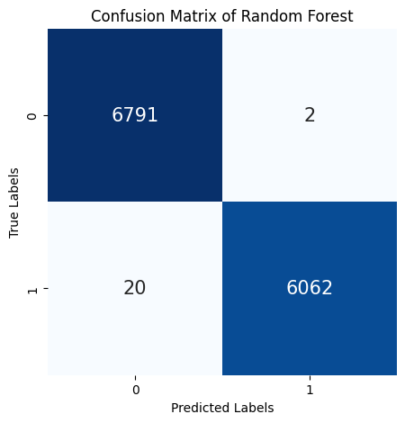
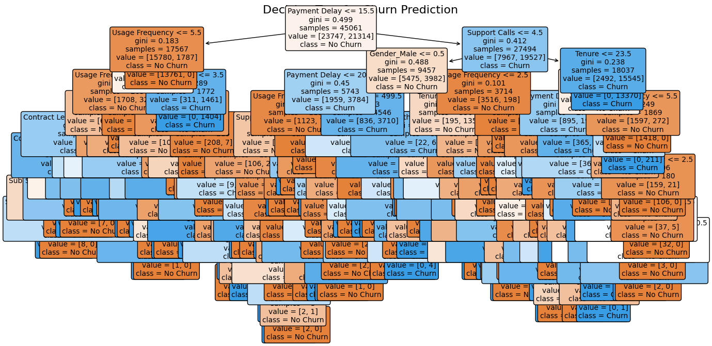
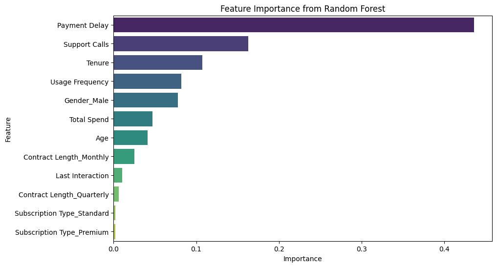
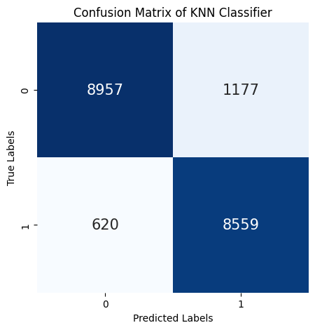
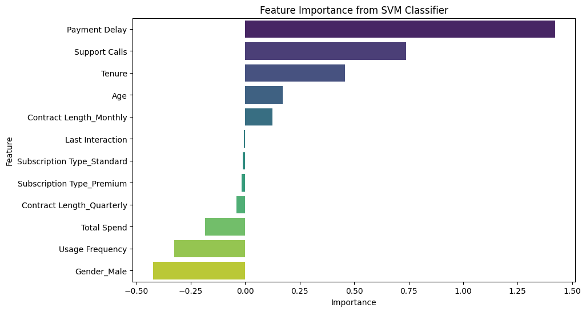
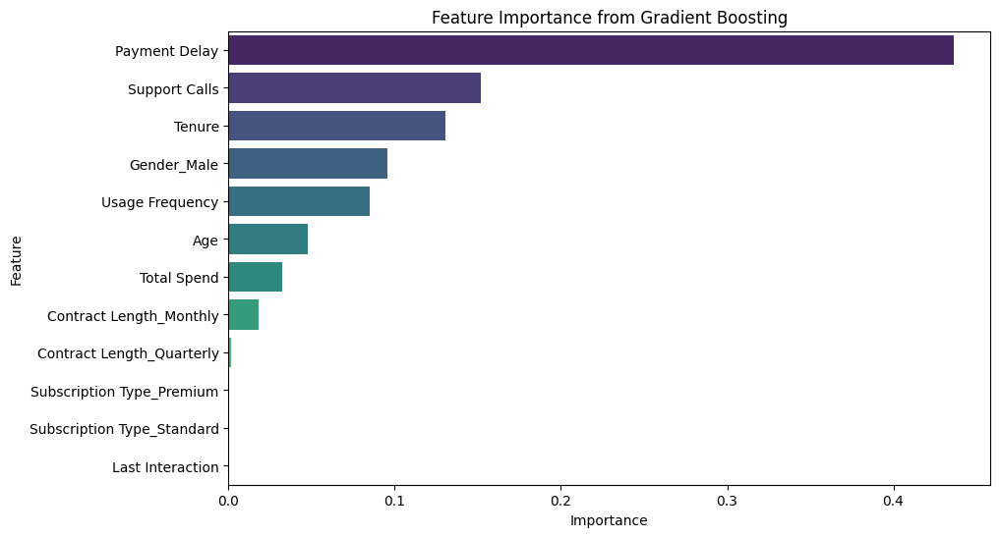

# Churn Pipeline: Data Science Case Study

This repository showcases a full churn modeling workflow from raw customer data to model comparison and business interpretation.

Instead of reporting one model score, the notebook compares multiple modeling families and evaluates trade-offs relevant for retention teams.

## Business Question

Which customer patterns are most associated with churn, and which modeling approach gives the most reliable signal for retention prioritization?

## Why This Matters

| Stakeholder | Decision Supported |
|---|---|
| CRM / Lifecycle Team | Which customers should receive save campaigns first |
| Product Team | Which customer attributes are linked to churn risk |
| Revenue Team | How much avoidable churn can be targeted with interventions |

## Dataset

- Scale: **64,374 customer records**
- Target: `Churn`
- Source file used in notebook: `hi.xlsx` (legacy name)
- Notebook now also supports local paths:
  - `data/churn_data.xlsx`
  - `data/churn_data.csv`
  - `hi.xlsx`

## Workflow (Architecture)



## Analysis Story

### 1) Exploratory Signal Check

The correlation and feature distribution checks are used to understand variable relationships before modeling.



### 2) Baseline Model: Logistic Regression

Logistic regression establishes an interpretable baseline and threshold behavior.



### 3) Tree-Based Models

Decision Tree and Random Forest achieve very high predictive performance on this split.




Feature importance plots help identify high-impact predictors.




### 4) Additional Classifiers for Comparison

KNN, SVM, and Gradient Boosting are included for broader model family benchmarking.





## Reported Model Performance (Notebook Run)

| Model | Key Reported Metric(s) |
|---|---|
| Logistic Regression | Accuracy `0.8263`, AUC `0.9050`, F1 `0.8184` |
| Decision Tree (tuned) | Accuracy `0.9975`, AUC `0.9989` |
| Random Forest | Accuracy `0.9983`, AUC `0.99999` |
| KNN | Accuracy `0.9070` |
| SVM | Accuracy `0.8303` |
| Gradient Boosting | Accuracy `0.9950` |

## Data Scientist Notes (Critical Thinking)

- Extremely high tree-based scores can reflect strong signal, but can also indicate leakage or split optimism.
- Before production use, validate with stricter evaluation:
  - leakage audit,
  - temporal or out-of-time split,
  - probability calibration,
  - uplift/A-B testing for retention action.

## Repository Contents

| Path | Purpose |
|---|---|
| `churn-pipeline.ipynb` | Main end-to-end analysis notebook |
| `images/` | Visual artifacts extracted from notebook outputs |
| `requirements.txt` | Python dependencies |

## Run Locally

```bash
pip install -r requirements.txt
jupyter notebook churn-pipeline.ipynb
```
