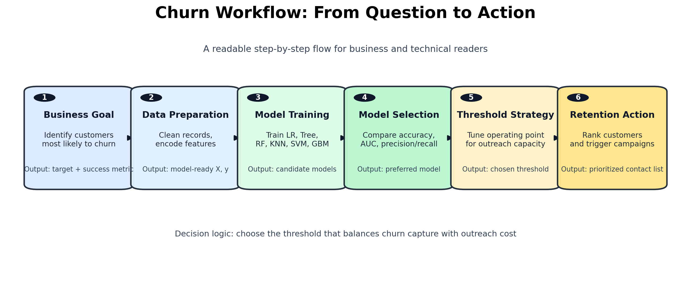

# Customer Churn Prediction Pipeline

This repository focuses on one business problem:

**Given limited retention capacity, which customers should be prioritized for outreach to reduce churn most effectively?**

It walks from raw data preparation to model comparison, threshold tuning, and operational interpretation.

## Executive Summary

- Dataset size: **64,374 customer records**
- Target: `Churn`
- Models benchmarked: Logistic Regression, Decision Tree, Random Forest, KNN, SVM, Gradient Boosting
- At a selected threshold near `0.5`, the logistic operating point achieves:
  - Accuracy: `0.8267`
  - Precision: `0.8138`
  - Recall: `0.8175`
  - F1: `0.8157`
- Main practical outcome: the workflow turns model scores into a **retention action strategy** (who to contact first and how aggressive to be).

## Business Problem

Churn prediction is not only a modeling exercise.  
The real decision is how to balance:

1. Catching as many true churners as possible (`recall`)
2. Avoiding too many unnecessary interventions (`precision`)

If threshold selection is ignored, a model can look strong on paper but perform poorly in actual retention operations.

## Project Objectives

1. Build a reproducible churn modeling flow from raw data.
2. Compare different model families, not just one algorithm.
3. Evaluate threshold trade-offs and connect metrics to operational cost.
4. Produce outputs that a product/CRM team can act on.

## Data Overview

- Total records: `64,374`
- Response variable: `Churn`
- Core feature themes:
  - customer profile: age, gender
  - engagement: usage frequency, last interaction
  - service friction: support calls, payment delay
  - value/revenue proxies: spend and subscription/contract fields

Accepted local input file names in notebook:

- `data/churn_data.xlsx`
- `data/churn_data.csv`
- `hi.xlsx` (legacy filename)

## End-to-End Workflow



## Method Walkthrough

### 1) Data Preparation and Feature Readiness

The notebook performs cleaning and categorical encoding before training.
This includes handling duplicates, missingness checks, and creating model-ready matrices.

### 2) Baseline + Threshold Analysis

Logistic Regression is used as the baseline because it is easy to interpret and suitable for threshold tuning.


Interpretation:
- lower thresholds increase recall but also increase false alerts
- higher thresholds reduce false alerts but miss more churners

### 3) Model Family Benchmarking

Multiple models are compared to test whether non-linear methods materially improve prediction.

| Model | Reported Performance |
|---|---|
| Logistic Regression | Accuracy `0.8263`, AUC `0.9050`, F1 `0.8184` |
| Decision Tree (tuned) | Accuracy `0.9975`, AUC `0.9989` |
| Random Forest | Accuracy `0.9983`, AUC `0.99999` |
| KNN | Accuracy `0.9070` |
| SVM | Accuracy `0.8303` |
| Gradient Boosting | Accuracy `0.9950` |


### 4) Operational Impact View

At the selected threshold (`~0.5`), confusion-matrix counts are:

| Outcome | Count |
|---|---:|
| True Positives (churn correctly flagged) | 4,936 |
| False Positives (unnecessary outreach) | 1,129 |
| False Negatives (missed churners) | 1,102 |
| True Negatives | 5,708 |


Operationally, this means the model can capture most churners while keeping false alerts within a manageable range for campaign teams.

## Decision Guidance for Retention Teams

| Decision Question | How this project supports it |
|---|---|
| Who should be contacted first? | Rank users by predicted churn probability and target highest risk |
| How large should outreach be? | Choose threshold based on team capacity and false-alert tolerance |
| How should success be measured? | Measure churn reduction lift, not only offline model metrics |

## Risks and Validation Notes

Some tree-based metrics are extremely high and require caution before production use.

Recommended next validation steps:

1. explicit leakage audit
2. out-of-time split (temporal validation)
3. calibration checks for probability quality
4. controlled campaign experiment to estimate true retention lift

## Repository Structure

| Path | Purpose |
|---|---|
| `churn-pipeline.ipynb` | Main notebook (full end-to-end analysis) |
| `images/` | Visual assets used in README |
| `scripts/generate_readme_visuals.py` | Regenerate workflow + summary visuals |
| `requirements.txt` | Python dependencies |
| `data/README.md` | Data placement instructions |

## Run Locally

```bash
pip install -r requirements.txt
jupyter notebook churn-pipeline.ipynb
python scripts/generate_readme_visuals.py
```
