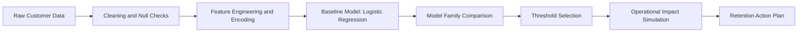
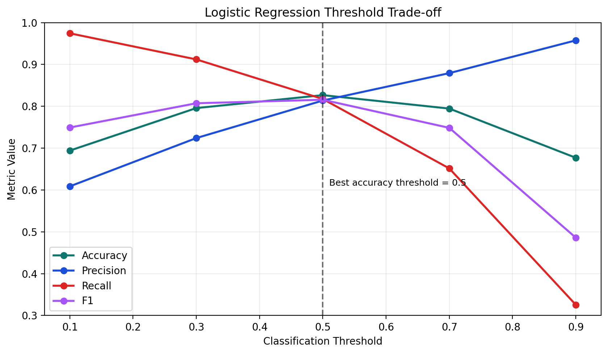
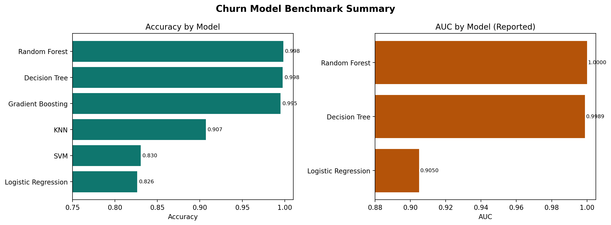
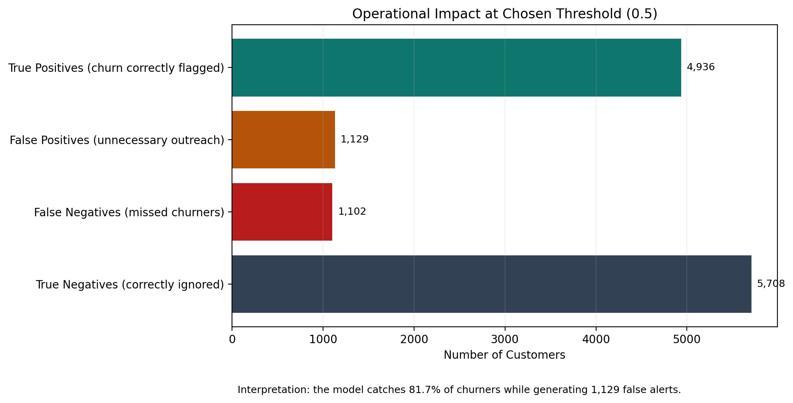

# Customer Churn Prediction Pipeline

This project answers one practical question:

**If a retention team can only contact a limited number of customers, who should they prioritize to reduce churn most effectively?**

The notebook walks from raw data to model decisions, then translates results into operational impact.

## Problem Context

Customer churn is expensive because replacing a lost customer usually costs more than retaining an existing one.
A usable churn model should do two things:

1. Rank customers by risk.
2. Keep a sensible balance between:
   - catching real churners (`recall`)
   - avoiding too many unnecessary outreach actions (`precision`)

## Data Used

- Records: **64,374 customers**
- Target: `Churn` (churn vs no churn)
- Main variables include tenure, usage frequency, support calls, payment delay, spending, and plan/contract attributes.

Input file compatibility in the notebook:
- `data/churn_data.xlsx`
- `data/churn_data.csv`
- `hi.xlsx` (legacy file name from original workflow)

## End-to-End Workflow



## Walkthrough

### Step 1: Build a Baseline and Understand Decision Thresholds

Logistic Regression is used as a transparent baseline.  
Instead of fixing one threshold blindly, the notebook evaluates how precision/recall/F1 move with threshold changes.



Why this matters:
- lower threshold catches more churners but increases false alerts
- higher threshold reduces false alerts but misses more churners

### Step 2: Compare Model Families

Multiple algorithms are tested to avoid relying on one modeling assumption.

| Model | Reported Performance |
|---|---|
| Logistic Regression | Accuracy `0.8263`, AUC `0.9050`, F1 `0.8184` |
| Decision Tree (tuned) | Accuracy `0.9975`, AUC `0.9989` |
| Random Forest | Accuracy `0.9983`, AUC `0.99999` |
| KNN | Accuracy `0.9070` |
| SVM | Accuracy `0.8303` |
| Gradient Boosting | Accuracy `0.9950` |



### Step 3: Translate Predictions Into Business Impact

At the selected operating point (threshold around `0.5`), the notebook confusion matrix implies:
- many churners are correctly captured
- a smaller but non-trivial number of false alerts remains

This is the key trade-off for retention operations.



## What This Means for a Retention Team

| Business Question | Model-Guided Action |
|---|---|
| Who gets contacted first? | Rank customers by predicted churn probability and prioritize top-risk segment |
| How aggressive should campaign volume be? | Tune threshold based on team capacity and acceptable false-alert rate |
| How should success be measured? | Track prevented churn uplift, not only model accuracy |

## Important Modeling Caution

Some tree-based metrics are extremely high.  
Before production deployment, run:

1. leakage audit
2. stricter validation split (for example out-of-time)
3. probability calibration
4. controlled retention experiment (A/B or uplift design)

## Repository Structure

| Path | Purpose |
|---|---|
| `churn-pipeline.ipynb` | Main notebook (full analysis) |
| `images/` | README visuals |
| `scripts/generate_readme_visuals.py` | Regenerate readable summary visuals |
| `requirements.txt` | Dependencies |
| `data/README.md` | Data placement instructions |

## Run

```bash
pip install -r requirements.txt
jupyter notebook churn-pipeline.ipynb
python scripts/generate_readme_visuals.py
```
