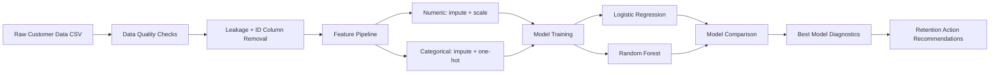
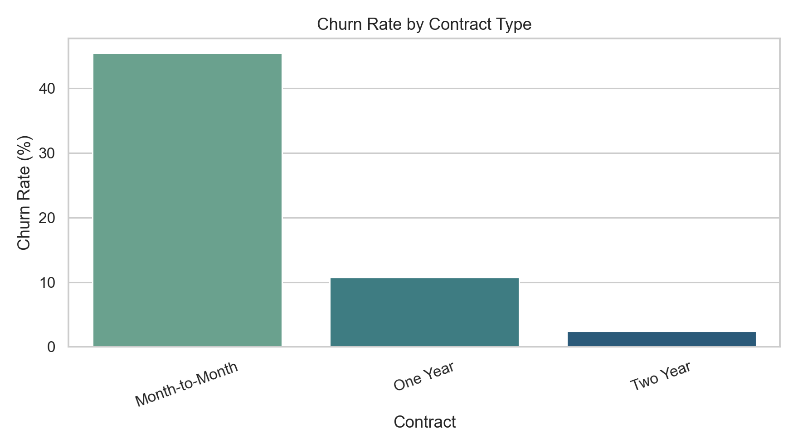
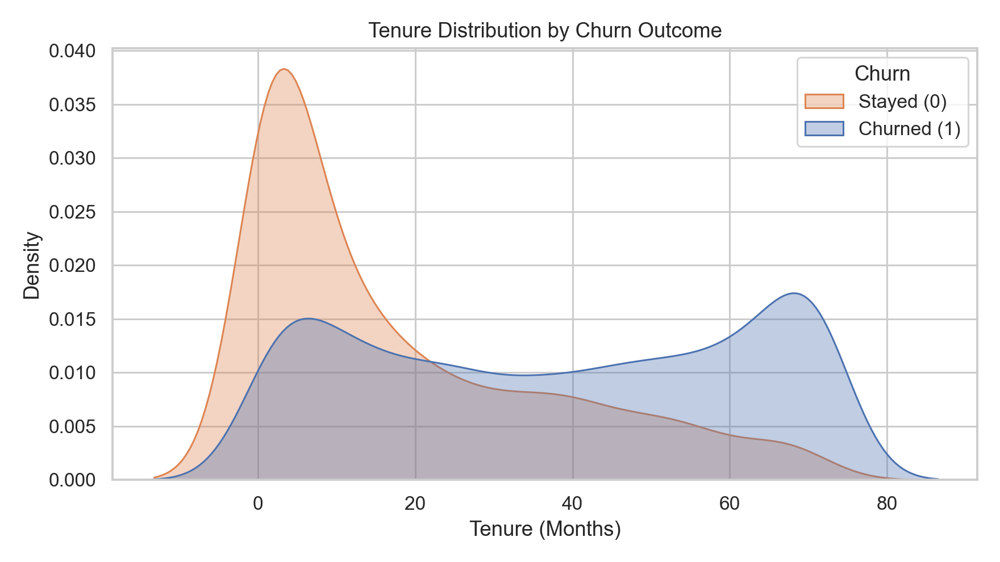
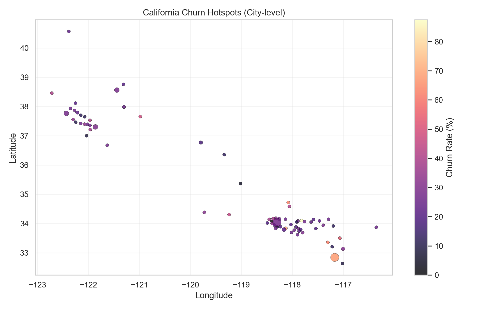
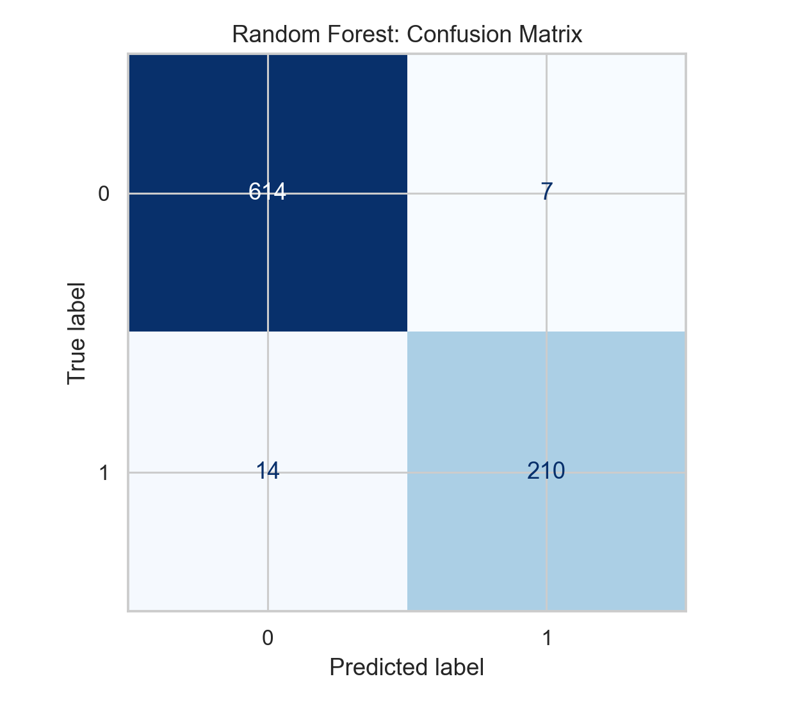
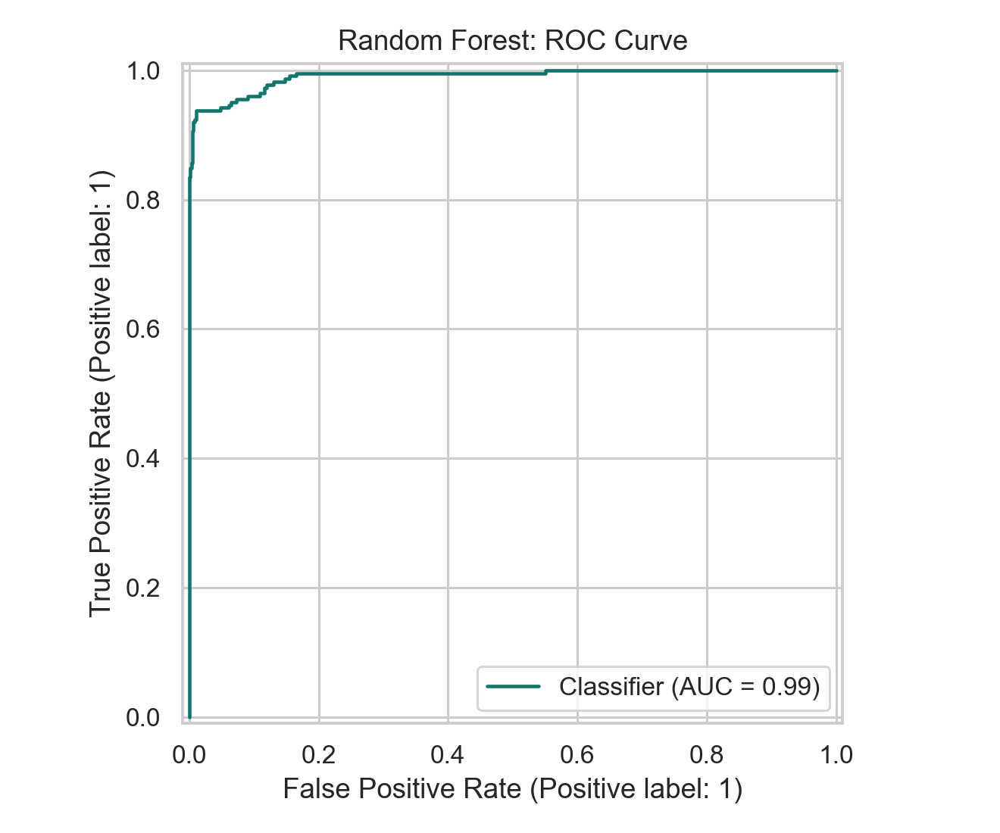
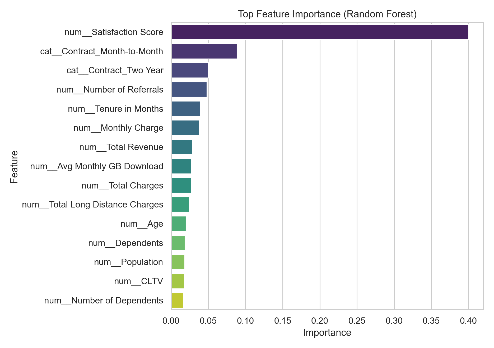

# Churn Pipeline: End-to-End Retention Modeling Case Study

This repository presents a practical churn analytics workflow from business framing to model-driven retention action.

The goal is not only to predict churn, but to translate model outputs into decisions a product, CRM, or customer success team can execute.

## Why This Problem Matters

Customer churn directly affects recurring revenue, CAC payback period, and growth efficiency.
If a company can identify likely churners early, it can prioritize interventions where they matter most.

| Stakeholder | Core Question | Decision Enabled by Data |
|---|---|---|
| Growth / CRM | Who is most likely to churn this cycle? | Target save campaigns to high-risk users |
| Product | What behavior patterns signal churn risk? | Improve onboarding and feature adoption |
| Customer Success | Which accounts need proactive outreach? | Prioritize retention queue by risk |
| Finance | What is the expected avoidable revenue loss? | Plan retention budget allocation |

## Dataset Snapshot

- Source file: `data/raw/telco_churn.csv`
- Scope: 4,225 customer records
- Target: `Churn` (1 = churned, 0 = stayed)
- Base churn rate: **26.53%**

## Project Workflow (Mini Architecture)



## Story Walkthrough

### 1) Segment-Level Risk Appears in Contract Structure

Contract type is one of the strongest business levers.

| Contract | Customers | Churn Rate |
|---|---:|---:|
| Month-to-Month | 2,193 | 45.46% |
| One Year | 904 | 10.73% |
| Two Year | 1,128 | 2.39% |

This is a major policy signal: contract structure is strongly linked to retention outcomes.



### 2) Churn Concentrates in Earlier Lifecycle Tenure

Tenure separation indicates churn risk is not uniform across lifecycle stages.
Lower-tenure users are over-represented in churn, which supports investing in onboarding and early-life engagement programs.



### 3) Geography Adds Prioritization Context

The city-level churn view helps operations teams localize interventions instead of running one-size-fits-all campaigns.



### 4) Modeling Results for Decision Support

Two model families were benchmarked with leakage controls in place.

| Model | Accuracy | Precision | Recall | F1 | ROC-AUC |
|---|---:|---:|---:|---:|---:|
| Random Forest | **0.9751** | **0.9677** | 0.9375 | **0.9524** | 0.9907 |
| Logistic Regression | 0.9503 | 0.8583 | **0.9732** | 0.9121 | **0.9938** |

Model selection here is driven by F1/recall balance for retention use cases. The selected model is **Random Forest**.




### 5) What Drives Churn in the Model

Feature importance highlights actionable patterns (for example satisfaction score, contract type, referrals, and tenure).



## Business Impact

This analysis supports a concrete retention playbook:

| Business Lever | Data Signal | Recommended Action |
|---|---|---|
| Contract migration | Month-to-month has highest churn | Incentivize migration to annual plans for high-risk accounts |
| Experience quality | Satisfaction score is a top predictor | Trigger CS outreach after low satisfaction events |
| Early lifecycle retention | Lower tenure users churn more | Launch 30/60/90-day onboarding nudges |
| Referral effects | Referral-related features are important | Add referral boosters for at-risk but engaged users |

## Notebooks

- `notebooks/01_churn_eda.ipynb`: EDA, segmentation, and business framing.
- `notebooks/02_churn_model_pipeline.ipynb`: preprocessing, model benchmarking, diagnostics.
- `notebooks/legacy/churn-pipeline-original.ipynb`: original raw notebook kept for traceability.

## Repository Structure

| Path | Purpose |
|---|---|
| `data/raw/telco_churn.csv` | Input dataset |
| `src/churn_pipeline/pipeline.py` | Reusable preprocessing, training, evaluation, figure logic |
| `scripts/run_pipeline.py` | One-command pipeline execution |
| `reports/figures/` | Exported charts used in this case study |
| `reports/model_metrics.csv` | Model benchmark table |

## Quick Start

```bash
pip install -r requirements.txt
python scripts/run_pipeline.py
```

## Positioning

This repository is structured as a **Data Scientist case study**: business problem framing, interpretable exploration, reproducible modeling, and decision-facing outputs.

